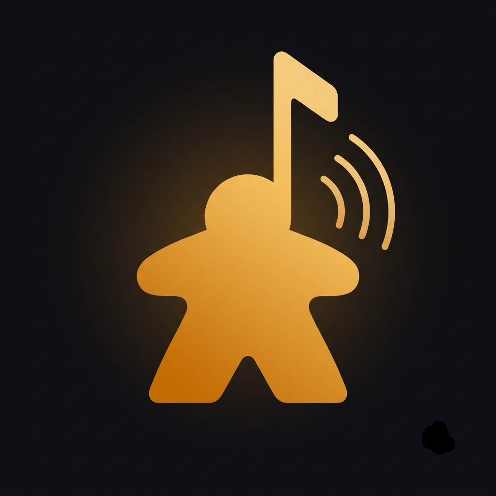
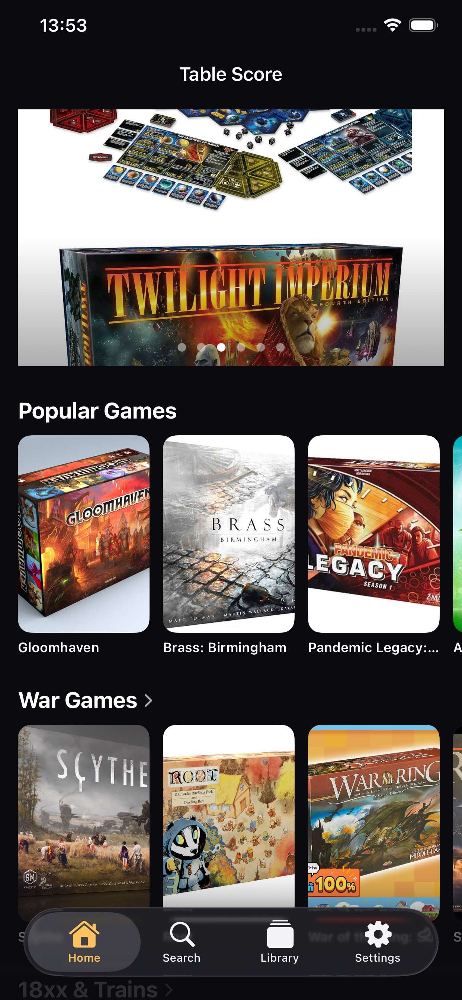
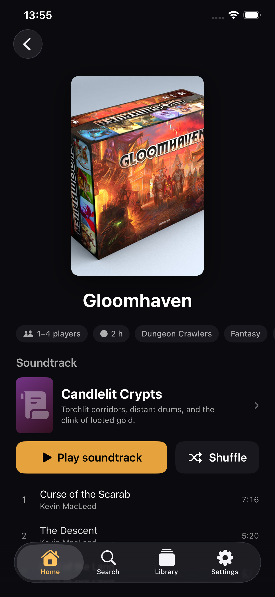
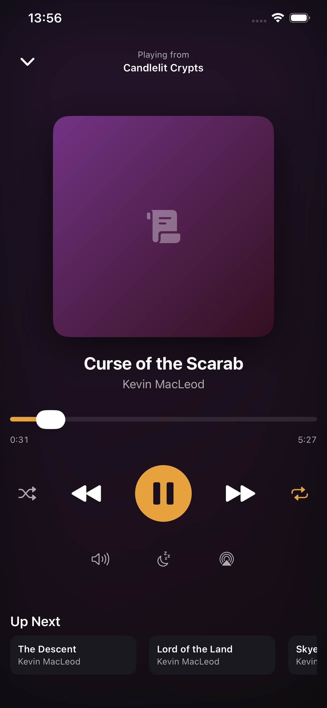
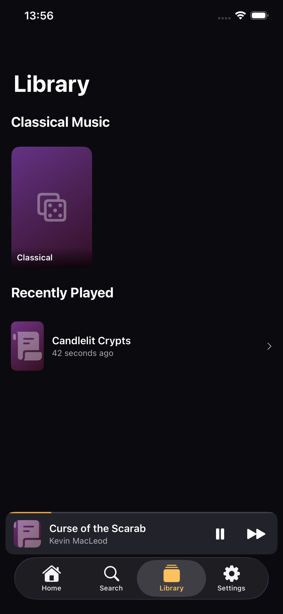
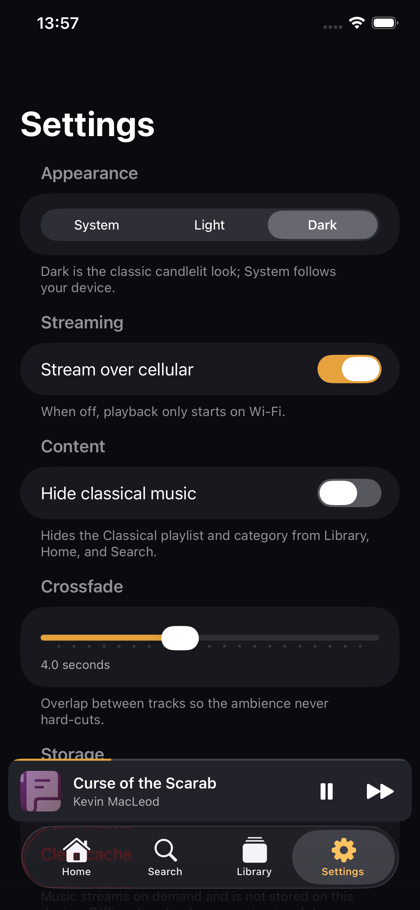

<div align="center">



# Table Score

**Background music for board game nights.**
Pick the game on your table — get its soundtrack.

iOS 17+ · SwiftUI · SwiftData · AVFoundation · no third-party dependencies

</div>

---

## What it does

Table Score is a background-music player built for the table. You browse by
**the game you're actually playing** — 105 titles, each mapped to a curated
soundtrack — hit play, and the music runs for the whole session: crossfaded,
looping, with a sleep timer and a one-tap volume duck for when someone has to
explain the rules again.

- **Game-first browsing** — find Gloomhaven, get *Candlelit Crypts*
- **18 curated playlists** across genre, mood, length and player count
- **Classical collection** — Pachelbel, Bach, Satie, Tchaikovsky, Joplin
- **Real crossfade** between tracks (two overlapping players, 0–10 s)
- **Background audio** with lock-screen controls and AirPlay
- **Sleep timer** and **duck for table talk**
- Dark by default (candlelight on a game table), plus light/system

## Screenshots

| Home | Game Detail | Now Playing |
|:---:|:---:|:---:|
|  |  |  |
| Browse by game, with box art | Every game maps to one soundtrack | Crossfade, sleep timer, queue |

| Library | Settings |
|:---:|:---:|
|  |  |
| Classical collection, favorites, history | Appearance, crossfade, privacy |

<sub>Captured at 1242 × 2688 (6.5″ display) — source files in <a href="Marketing">Marketing/</a>.</sub>

## Architecture

Data flows one way:

```
catalog.json manifest → CatalogSyncService → SwiftData → @Query-driven UI
                                                  ↑
                                    PlayerService (@Observable, injected)
```

| Module | Purpose |
|---|---|
| `TableScore/Models` | SwiftData models: `Game`, `Track`, `Playlist`, `GameCategory`, `PlaybackStateRecord`. Ids are the catalog's string slugs so sync can diff by manifest id. |
| `TableScore/Catalog` | `CatalogSource` protocol (backend or bundled fixture), manifest DTOs, `CatalogSyncService` (upsert/diff, preserves user state, removes deleted ids). |
| `TableScore/Player` | `PlayerService` (@Observable facade), `CrossfadeEngine` (two AVPlayers so tracks can overlap), `PlayQueue` (pure, unit-tested shuffle/repeat logic), `NetworkMonitor`. |
| `TableScore/DesignSystem` | Theme tokens, shimmer loading, deterministic gradient placeholder art (keyed by id — used in views *and* lock-screen artwork). |
| `TableScore/Features` | Game-first Home, game detail, category grid, playlist detail, Now Playing + mini player, Search, Library, Settings. |

Three details worth knowing before changing things:

- **`CrossfadeEngine` uses two `AVPlayer`s on purpose.** An `AVQueuePlayer`
  cannot overlap items, and crossfade requires exactly that. The queue advances
  *when the fade starts*, not when the outgoing track ends.
- **`PlayQueue` is a pure struct** with no AVFoundation — that's what makes the
  shuffle/repeat logic unit-testable with a seeded RNG.
- **Playlist track order is stored explicitly** (`orderedTrackIDs`), because
  SwiftData to-many relationships don't guarantee ordering.

**Game-first browsing:** each game carries a hand-curated `playlistId` in the
manifest (Scythe → *Drums of War*). There is no matching logic in the app —
re-curating a soundtrack is a manifest edit, not a code change.

## Backend

A self-hosted [PocketBase](https://pocketbase.io) instance on an Oracle Cloud
Always Free VM, behind Nginx with Let's Encrypt HTTPS. It serves the catalog,
audio files and box art, and collects anonymous, opt-in usage events.

| Path | Purpose |
|---|---|
| `backend/pb_migrations/` | Schema as JS migrations, auto-applied on service start |
| `backend/pb_hooks/catalog.pb.js` | Renders `/api/catalog.json` in the app's manifest format, ETag + cache headers |
| `backend/migrate_content.py` | Seeds catalog content, uploads audio |
| `backend/upload_game_art.py` | Uploads box art, matching filenames to catalog slugs |
| `backend/provision.sh`, `setup_server.sh`, `deploy.sh` | Infrastructure |

The manifest `version` is derived from the newest record timestamp across
content collections, so any edit in the PocketBase admin UI bumps it and
clients resync automatically. See [`backend/README.md`](backend/README.md).

## Build & run

```sh
# Build
xcodebuild -project TableScore.xcodeproj -scheme TableScore \
  -destination 'platform=iOS Simulator,name=iPhone 17 Pro' build

# All tests (catalog sync/diffing + queue logic)
xcodebuild -project TableScore.xcodeproj -scheme TableScore \
  -destination 'platform=iOS Simulator,name=iPhone 17 Pro' test

# A single test class
xcodebuild ... test -only-testing:TableScoreTests/PlayQueueTests
```

Or open `TableScore.xcodeproj` and hit Run. The project uses file-system
synchronized groups (Xcode 16+), so files added to the folders are picked up
automatically — never add per-file entries to the pbxproj.

The app syncs from the backend in every configuration. For offline development
against the bundled fixture, launch with the `-UseBundledCatalog` argument and
serve the local media with `Tools/serve_devcdn.sh`.

### Signing for a real device

Target *TableScore* → *Signing & Capabilities* → select your team. Bundle id is
`com.ozsoffy.tablescore`. Background audio is already configured via
[`Support/Info.plist`](Support/Info.plist) (`UIBackgroundModes: audio`).

## Media

**The app bundles no audio and no box art, and neither is committed here.** Both
live on the backend (~700 MB), which keeps this repo small and fast to clone.
`AVPlayer` streams tracks progressively; `ArtworkView` loads box art remotely and
falls back to deterministic gradient placeholders when a URL is absent, so mixed
catalogs are fine.

To repopulate a server, see [`assets/README.md`](assets/README.md) for the
expected layout, then run `backend/migrate_content.py` and
`backend/upload_game_art.py`.

## Music & licensing

All music is **Kevin MacLeod (incompetech), CC-BY 4.0** — commercial and
ad-supported use is permitted with attribution, which the app provides on the
**Settings → Music Credits** screen. Every track carries `composer`, `license`,
`sourceURL` and `creditText` from the manifest into SwiftData, and
[`Tools/sources.csv`](Tools/sources.csv) is the download audit trail.

Only commercial-safe sources are allowed; anything licensed non-commercial
(CC-BY-NC in any variant) is banned outright. See
[`LICENSING.md`](LICENSING.md) for the approved-source list and the compliance
rules baked into the app.

Game metadata is courtesy of [BoardGameGeek](https://boardgamegeek.com) — the
`attribution` field on every game must not be stripped. Box art is the
respective publishers' copyright; see [`assets/README.md`](assets/README.md) for
the pre-release checklist.

## Known deviations from the spec

- Model ids are `String` (catalog slugs), not `UUID` — required for stable sync diffing.
- The spec's `Category` model is named `GameCategory`, to avoid colliding with common framework type names.
- Display name is **Table Score** (two words); code, targets and bundle ids keep the one-word `TableScore` internally.

## Docs

| File | What's in it |
|---|---|
| [`TableScore-Spec.md`](TableScore-Spec.md) | Product spec (source of truth) |
| [`CLAUDE.md`](CLAUDE.md) | Architecture notes and repo conventions |
| [`LICENSING.md`](LICENSING.md) | Approved music sources, compliance rules |
| [`assets/README.md`](assets/README.md) | Media layout and how to repopulate |
| [`backend/README.md`](backend/README.md) | Server runbook |

---

<div align="center">
Developed by <b>Oz Soffy</b>
</div>
